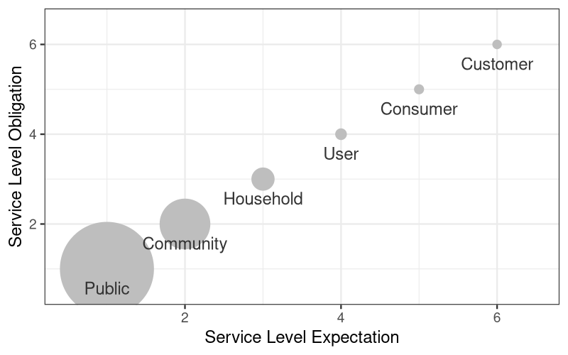
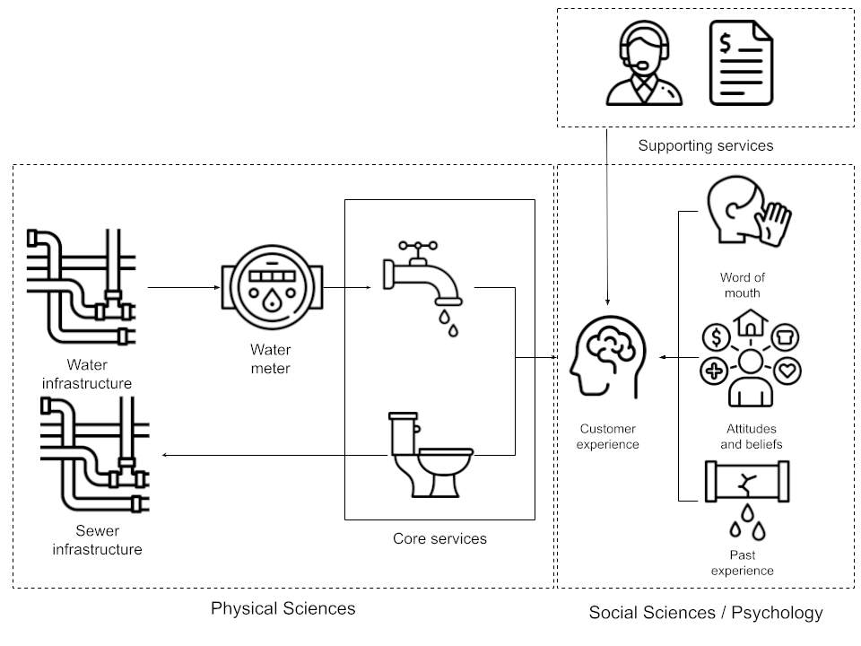

#+title: Introduction
#+latex_header: \usepackage{multirow}
#+macro: voc /Voice of the Customer/
#+bibliography: book/voc.bib
#+cite_export: csl book/apa6.csl
#+todo: DRAFT EDITED | REVIEWED

* EDITED The Social Importance of Water
Almost all publications on water management open with the cliché that water is essential to life, health, and human dignity. It is an immutable truth that without water life is impossible and that it is an irreplaceable resource for commercial processes, most significantly food production and power generation [cite:@kurland_2010_water;@braden_2009_social;@wagner_2013_soc]. But this description is only a partial truth about water consumption.

Humans require about seventy litres per person per day for life's essentials, including growing food [cite:@reed_2011_how]. However, water consumption in countries with improved water supplies is much higher than seventy litres per person per day. The difference between the minimal amount required to maintain life and actual consumption is not wasted; it provides intangible social benefits. Water not only ensures physical life but also enables social interactions [cite:@wagner_2013_soc; @allon_2006_dams].

Watering your garden, bathing your child, doing the dishes with your partner or swimming with friends are mundane, but psychologically and socially significant experiences. The daily hot shower is part of a personal ritual that transforms the private self into the public self. Bathing is a cleansing ritual that purifies the body from the everyday world. The purpose of human grooming activities is not only to maintain hygiene but also to modify the body's colour, odour and perceived shape to match societal expectations. Grooming communicates an individual's social identity, and water is a pivotal artefact in this private ritual [cite:@rook_1985_ritual]. The daily shower is also a major source of innovation. We all know the experience of having great ideas while enjoying a hot shower. Consequently, when a water utility issues shower timers to save water, it also restricts innovation. Water also has religious connotations, as it features in baptisms, agricultural ceremonies, and other rituals [cite:@wagner_2013_soc; @lansing_1987_balin]. In Australian indigenous cultures, water forms an integral part of the world of ancestral beings, conceptualised in myth, painting and dance [cite:@barber_2011]. This vignette of water from a sociological perspective shows that water is not only for sustaining the basics of life; it also plays an important role in our social lives.

Water professionals excel at measuring the physical characteristics of water supply systems, but often struggle to capture the equally important social dimension of water consumption. Water is consumed behind the customer's meter, beyond the utility's measurement instruments. Parameters collected to assess the continuity and safety of a water supply provide limited insight into how customers experience their service. The instrumentation that measures the state of a water supply system leverages the laws of physics, chemistry and biology. To extend monitoring downstream from the water meter into the customer's mind, we need a different paradigm and seek assistance from the social sciences and psychology.

This book helps water professionals to reach beyond the water meter by introducing a collection of tools to understand the customer experience. Incorporating the {{{voc}}} (VOC) to capture experiences and opinions as a data stream enlists consumers as measurement devices, providing insight into the complete water cycle, both upstream and downstream of the water meter.

** Customer Centricity
As natural monopolies, there is little economic incentive for a water utility to be customer-centric in the same way as commercial entities in the free market are. Water utilities don't need to find new customers or prevent existing ones from changing service provider. Recent societal developments have changed this basic economic truth, compelling water utilities to act more like free-market participants and to elevate their anonymous rate payers to customers with individual needs. The spectre of water shortages around the world has increased attention for water. This attention is largely aimed at the future uncertainty of water supplies due to population growth and climate change. Additionally, water utilities struggle with ageing infrastructure and invest substantial sums to maintain high service levels for the communities they serve. These problems put pressure on water prices, no pun intended. Regulators and the public insist that water utilities focus more on customers, beyond simply providing a reliable water supply through technological solutions. Also, customer advocacy groups compel water utilities to improve the quality of their customer engagement [cite:@prevos_2017_cust].

The increased attention from regulators on how utilities relate to customers has profoundly changed the industry across many jurisdictions worldwide. Regulatory frameworks often require water utilities to initiate customer engagement programs. Economic regulation acts as a proxy for the motivational mechanisms intrinsic to competitive markets that drive service providers to maximise value for their customers [cite:@prevos_2017_cust]. Although water utilities do not compete for customers, most regulators stimulate artificial competition. Regulators use market-mimicking practices, such as performance benchmarking, to hold utilities accountable to their customers. In this so-called 'yardstick competition' business performance of monopolistic service providers is compared with peer organisations [cite:@braadbaart_2007_coll]. 

* EDITED What is the Voice of the Customer?
:NOTES:
- [X] From TQM to marketing [cite:@griffin_1993_voic]
- [-] WuM is different
- [X] VoC and service quality (is it all really service evaluation?) Service quality multimodal methods
:END:
Humans have been recording their thoughts, conversations, hopes, and dreams in writing for thousands of years. The earliest record of customer feedback dates back almost as far as writing itself. A Mesopotamian customer named Nanni complained to a copper trader on a cuneiform clay tablet, lamenting the poor service (British Museum, BM 131236). We no longer use clay tablets to express our thoughts but use electronic records. Electronic communication leaves digital footprints throughout the customer journey, enabling service providers to better understand their customers' needs. Whether these records will survive for millennia is doubtful, but they are certainly useful in the present.

The {{{voc}}} concept emerged from the intersection of Japanese Total Quality Management (TQM) approaches of the 1960s and methods to convert user demands into technical specifications. While originally used for product design, in services, VOC has evolved into a method for both designing new market offerings and assessing the quality of delivered services. [cite/t:@griffin_1993_voic] first formally codified this concept in management science. In these early days of the {{{voc}}}, sporadic research was undertaken with focus groups and customer surveys. In the 21^{st} century VOC has transitioned from episodic research to a continuous stream of electronic feedback. Before the electronic age, water managers relied on intermittent surveys of a small sample of customers. Now, almost every transaction with a customer leaves a digital footprint. Also, user-generated content, such as social media posts, provides useful insights. Continuous information is available through digital sources such as social media, newspaper articles, customer phone call transcripts, focus groups, formal surveys, and similar sources.

The {{{voc}}} is an umbrella term for a monitoring program to gauge the needs, wants, attitudes, and judgements of their current or future customers. A VOC program collects, analyses and acts on customer feedback on their experience. This definition is perhaps a bit vague, so let's develop a deeper understanding of who water utility customers are, what their 'voices' are, and how this applies to water utilities.

** EDITED Who are customers?
:NOTES:
- [X] Shorten customer labelling section
:END:
Defining a customer is not as straightforward as it might seem. The word customer implies a commercial relationship between an individual and an organisation for the purpose of economic exchange. The international standard for the assessment and improvement of water services describes a customer as a "registered user" [cite:@iso24510]. Water utilities generally maintain customer records in their billing or customer relationship systems. Most such systems equate customers with a connection to the reticulation. Each connection has one or more registered users and possibly additional water consumers. The water industry uses a range of labels for customers. In the narrow view, customers are the people responsible for paying the bill; in the broadest context, the utility looks after everyone who lives in its service area.

The labels used to describe service beneficiaries provide insight into the relationship between them and their service provider. Drawing from labelling theory, these labels express the nature of the relationship between service providers and their beneficiaries. The terminology to label beneficiaries alters how they expect to be treated. For example, a university student or a hospital patient has a different relationship with their service provider than a guest in a hotel or a passenger on an aeroplane. Using "student" or "patient" implies an imbalance of power in which the customer is not always right. Another example is that the word consumer implies a more distant, impersonal relationship than the word customer. A consumer is an anonymous person who consumes, while a customer has a formal relationship with the service provider [cite:@syed_2011_cust; @plangger_2013_nomen]. 

Water industry technical journal articles contain a wide range of synonyms to describe the beneficiaries of water utility services. The most common ones are "Public", "Community", "Household", "User", "Consumer", and "Customer". These labels are interchangeable, as some articles use both terms. This interchangeability is an artefact of the conditions in which utilities operate. Within any given service area, every household is connected to the water system, and within each household there is at least one customer and consumer. But also, people in service regions not connected to improved water services are impacted by the utility through public amenities and civil construction works [cite:@prevos_2017_cust].

The psychological contract between the service provider and the customer can be visualised with a relationship ladder. More personal terms score high on the obligation and expectation dimensions, while labels that indicate an impersonal relationship signify low expectations for both parties (figure [[fig-ladder]]). The highest number of search hits in water industry journals (public, community, household) are placed at the bottom of the relationship ladder, as they refer to groups of people. The other three labels (user, consumer, and customer) are higher up the ladder, as they refer to a more personal relationship. The larger the number of people covered by the label, the weaker the relationship. Referring to water beneficiaries as the public suggests a weaker relationship than referring to them as customers. Figure [[fig-ladder]] shows that collective labels are more common in the industry literature than individual customer labels. The collective labels emphasise the social benefits of water and the dominance of professional judgement, while the singular labels emphasise the private benefits of water and consumer judgement [cite:@laing_2003_mark]. The more common use of collective labels rather than singular labels indicates self-identification within the water utility industry as an impersonal public service rather than a private one.

#+header: :width 800 :height 500
#+header: :file images/relationship-ladder.png
#+begin_src R :results output file graphics  :exports results
  # Relationship ladder for IWA journals

  library(ggplot2)
  label <- c("Public", "Community", "Household",
             "User", "Consumer", "Customer")
  Entries <- c(2425, 1282, 555, 251, 208, 194) # 8 May 2015
  ladder <- data.frame(label, expectation = 1:6, obligation = 1:6, Entries)
  ggplot(ladder) +
    aes(x = expectation, y = obligation, label = label) +
    geom_point(colour = "grey", size = Entries / 40) + scale_size_area(max_size = 20) +
    geom_text(color = "gray20", vjust = 2) +
    expand_limits(x = c(0.5, 6.5), y = c(0.5, 6.5)) +
    labs(x = "Service Level Expectation",
         y = "Service Level Obligation") +
    theme_bw(base_size = 24)
#+end_src
#+caption: Relationship ladder for water utility beneficiaries.
#+name: fig-ladder
#+RESULTS:

It could be argued that labelling water consumers as customers is disingenuous because there is an inherent power imbalance between water utilities (or any other public service) and their beneficiaries. Customer's can't choose their water service provider and the core service is the same for everybody. A commercial organisation differentiates their service for each segment of their customer base. Labelling the community as customers and consumers is a strategic choice to provide a stronger relationships between the utility and the community, public service obligations not withstanding.

Marketing scholars circumvent the labelling complexity by referring to anyone with a relationship with a service provider as a beneficiary [cite:@lusch_2014_sdl]. The neutrality of this term notwithstanding, this book uses "customer", ignoring labelling complexities and following common conventions. The term /Voice of the Beneficiary/ does not have the same ring as {{{voc}}}. When this book mentions customers, it can include any beneficiary of the process under consideration. The specific label applied to the customers whose voices we are interested in depends on the analysis context. When the VOC program focuses on capital investments then the customer can include anyone in the community. When, for example, analysing people in financial hardship, the term customer applies only to this subgroup of the total cohort of paying customers. 

** DRAFT The Voice of the Customer in Water Utilities
The literature on implementing a VOC program more often than not focuses on the shared goals of commercial organisations, such as retaining existing customers and returning to shareholders. A well-designed VOC program can deliver a competitive advantage over those service providers who choose not to listen to their (potential) customers. Water utilities have a different reason for being than commercial organisations. Customer acquisition and retention are not a concern for a service provider that is a natural monopoly, so a VOC program needs to reflect the specific environment in which a water utility operates.

Customers express their views on the service provider, either directly or indirectly. The direct {{{voc}}} relates to the literal voice of the customer through customer contacts phone, email and so on), user-generated online content such as social media but also earned media. The direct VOC is also recorded in surveys, either through qualitative comments or qualitative scales. The VOC can also be indirectly derived from technical measurements in a water supply system. Water engineers measure pressure, flow, and quality parameters that indirectly reflect how consumers experience water service. These measurements reflect the engineer's perspective on a water system's performance, but that is not necessarily the same as the customer's perspective.

** Applications
:NOTES:
- [X] investment decisions
- [X] Yardstick competition
- [ ] Pricing
- [ ] Add details
- [ ] VOC not as a "nice-to-have" or a bureaucratic burden, but as a risk-mitigation tool (e.g., identifying infrastructure failure before it becomes a catastrophe, thus reducing long-term OPEX).
- [ ] 
:END:
The outcomes of a VOC program are an essential input into almost all decision processes in a customer-centric organisation. Whether for setting future prices, assessing investment options or designing new supplementary or supporting services. Continuous monitoring of the VOC is useful for performance reporting, both internally and externally.

As monopolistic service providers, they set prices for water services without being bound by market forces. The {{{voc}}} is an essential input into this process to ensure that prices and customer benefits remain in a healthy balance. 

Triple Bottom Line (TBL) accounting, first coined by John [cite/t:@elkington_1998_accoun], compares economic, social, and environmental costs and benefits to determine the preferred solution to a problem. While the financial bottom line can be easily quantified, the other two are more qualitative and difficult to grasp. The social bottom line relates to social capital, which Elkington relates to the level of trust a community has in an organisation. VOC methods are, in this sense, a useful tool for rationally determining the social dimension of the TBL.

Water utilities not only provide core services through their pipes, but also offer supporting services that include facilitating and enhancing elements [cite:@lovelock_2007_serv]. The core service is the fundamental benefit the utility provides (clean, reliable water services). The facilitating services are required to deliver the core service, such as payment and billing. Enhancing services adds extra value and appeal for customers, such as consultation on how to use water or assistance with financial hardship. A {{{voc}}} program provides information about how customers perceive the core services. Core services are less configurable than supporting services. Data from a VOC program also helps water utilities to design supporting services to maximise benefit to consumers.

* Phenomenology of the Customer Experience
:NOTES:
- [ ] Latent variables
- [ ] neuromarketing
:END:
The {{{voc}}} is usually silent to the water utility. Unlike service providers, which directly interact with their customers, water utilities deliver services at arm's length. The customer's voice is mostly disembodied and only reaches the utility when something goes wrong or when explicitly asked to provide feedback. Water utilities have little insight into what happens downstream of the water meter in the customer's plumbing and focus their analytical efforts upstream, expressed in figure [[fig-voc]].

The customer experience is a complex phenomenon that begins with the objective physical qualities of the water but is also a subjective construct influenced by social and psychological forces. The customer interacts with the water utility's services through their plumbing, and their experience is a direct consequence of the physical state of the network and the core service delivery. This experience is not an objective measurement, but a mediated subjective experience. Firstly, their experience with core services is mediated by their experience with the utility's supporting services, such as billing, complaint handling, leak repairs, and other such interactions. The supporting services define the brand of the water utility [cite:@lovelock_1992_flow]. The experience with core services is also mediated by word of mouth, including through social media and news articles. Our opinions are strongly influenced by what other people believe. A person's attitudes and beliefs influences how they assess a service. Consumption of tap water is shaped by social expectations of cleanliness, pleasure-seeking behaviour and by the psychology of the consumer [cite:@allon_2006_ever]. Lastly, past experiences with their water service provider also mediate the current experience. When, for example, a town is experiencing taste and odour issues with its water supply, it will take a long time for that trust to recover. 

We can only understand the voice of the customer as an expression of the customer experience through this multimodal lens. There is no customer experience-o-meter we can attach to someone's brain to determine their state of mind when using tap water.

#+header: :width 1200 :height 600
#+begin_src dot :file images/voice-of-the-customer.png
  digraph voc {
      dpi=300;
      rankdir=TB;
      nodesep=0.6;
      ranksep=0.6;
      node[fontname="Helvetica"]
      core [shape=box, label="Core Services", width=1.4]
      meter [shape=box, label="Water Meter", width=1.4]
      cons [shape=house, label="Consumer", width=1.4, height = 1.4]
      voc [shape=cds, label="Voice of the\nCustomer", width=1.4, height=1]
      supp [shape=plaintext, label="Supporting\nService", width=1.4]
      wom [shape=plaintext, label="Word of\nMouth", width=1.4]
      att [shape=plaintext, label="Attitudes\nand Beliefs", width=1.4]
      pre [shape=plaintext, label="Previous\nExperiences", width=1.4]
      
      {rank=same; core; meter; cons; voc; }
      
      core -> meter -> cons -> voc

      supp:s -> cons:n
      cons:s -> wom:n [dir=back]
      cons:s -> att:n [dir=back]
      cons:s -> pre:n [dir=back]
  }
#+end_src
#+caption: Conceptual Framework for Voice of the Customer (VoC) in Water Utilities.
#+name: fig-voc
#+RESULTS:

The phenomenology of the customer experience prioritises the consumer's first-person perspective over the engineer's physical measurements. From the perspective of the water utility the objective reality of a water supply is expressed in units such as kilopascals, NTUs and cubic meters. However, the customer does not experience pH 7.2; they experience softness on their skin or a crisp taste in their glass.

The phenomenology of water consumption is complex because objective physical parameters cannot always be directly translated to the subjective customer experience. A consumer enjoying a bath might experience it as an event in which she contemplates her life or generates creative ideas. Expressing this in terms of physical parameters such as pH, turbidity, and so on does not do justice to the customer's experience. The experience of tap water is thus defined by a complex a combination of factors, dominated by subjectivity.

This book is not arguing to replace physical metrics in favour of subjective customer opinions. Both types of measurements are of equal importance to the effective functioning of a water utility, or any provider of technical services. The {{{voc}}} add a secondary sensory layer. Just as a pump has a vibration sensor to detect bearing wear, the VOC program is a "social sensor" for operational health.

* How to Read this Book
:NOTES:
Chapters:
2. [@2] Quantitative Customer surveys; Latent Variables and Factor Analysis.
3. Qualitative data science: Human vs machine analysis
4. Basic Text Analysis: descriptive analysis, DTM etc.
5. Sentiment Analysis: 
6. Topic Modelling: Discovering Latent Themes
7. Experiential Analysis: Sensory Science and Controlled Experiments
8. The Indirect Voice: SCADA, IoT, and Physical Proxies.
9. Synthesis: Managerial relevance, practical implementation
:END:
The remaining chapters of this book are divided into three parts. Chapters two to five discuss analysing qualitative information from traditional manual methods to cutting-edge Large Language Models (LLM). The following two chapters discuss numeric methods for extracting meaning from surveys and for converting operational data to the customer's perspective. The final chapter discusses options for implementing and operationalising a {{{Voc}}} program.

Qualitative data analysis is an ancient technique that is as old as writing itself. Through the ages, scholars have developed systematic approaches to extract meaning from large volumes of text. With the advent of powerful computers, the paradigm has shifted to a more mathematical approach. Chapter [[#chap-qual]] discusses techniques for analysing textual data, including content and thematic analysis. With the advent of the internet, these techniques are no longer sustainable due to the vast amount of textual data available. The second part of this chapter outlines computational methods for extracting VOCs from a large collection of texts (a corpus).

Before computers can analyse a text, it must be converted to a numeric format. Chapter [[#chap-text]] introduces the basic principles of statistically exploring a text corpus. This chapter explains how to convert a text corpus into tokens and convert unstructured textual data into a matrix suitable for statistical analysis. This chapter closes with an introduction to word embeddings, the most advanced method for converting text to a numeric representation used in LLMs. This chapter closes with a case study using a transcript of simulated interviews with a water utility customers to demonstrate these various techniques and perform an exploratory analysis.

Once a text is represented in a numeric format, we can determine what the text is about and how the customer felt when they spoke or wrote these words. Chapter [[#chap-sentiment]] shows how to extract sentiments from a collection of texts. A sentiment is an explicit or implicit attitude that a customer expresses towards the service provided by a water utility. This chapter discusses the basic techniques using sentiment lexicons and introduces more complex supervised machine learning models and Large Language Models. The case study for this chapter is a collection of social media posts about tap water that compare different methods for extracting sentiment.

Knowing how the customer feels when they communicate is valuable, but we of course also need to know what they are talking or writing about. Chapter [[#chap-topic]] describes how to undertake topic analysis using unsupervised machine learning (Latent Dirichlet Allocation) and more recent methods using word embeddings, leveraging the capabilities of LLMs.

After discussing methods for analysing textual data, we also need to account for numerical analysis in a VOC program. Chapter [[#chap-survey]] discusses techniques for developing and analysing numerical surveys. This chapter uses the techniques of psychometric analysis, which is the science of objectively measuring latent constructs, such as customer satisfaction and consumer trust, that cannot be measured directly. This chapter uses a case study of American water utility customer data to demonstrate how to apply advanced statistical techniques to test the validity and reliability of a survey.

The penultimate chapter provides some examples of indirect VOC measurement using normal operational data. Monitoring pressure, quality, reliability, and other engineering parameters provides insight into the state of the water network, but only when recast from the customer's perspective. This chapter also describes an experiential method for generating VOC data by organising employee water-taste testing events.

The final chapter discusses methods for implementing {{{voc}}} techniques across various use cases in a water utility. Knowing what customers talk about and how they feel about it is interesting, but we need to extract actionable insights from this data. Finally, extracting information from customers has ethical implications, so this book concludes with thoughts and recommendations on collecting sensitive customer data and using algorithmic fairness to ensure that the data is collected in the best interests of the community. 

* Supplementary Material and Licensing
This book is accompanied by relevant data and source code in the R language for statistical computing [cite:@team_2026_r] and associated external packages to illustrate the analytical techniques described in this book. The code used to analyse the case studies is not included in these pages, but is only available on a GitHub repository.[fn:1] For more information on how to use the R language to solve water management problems, refer to /Data Science for Water Utilities/ [cite:@prevos_2023_r4h2o].

All code in this repository is licensed under the GNU General Public License (version 3). This license grants four basic freedoms:

- The freedom to run the program as you wish, for any purpose.
- The freedom to study how the program works, and change it so it does your computing as you wish.
- The freedom to redistribute copies so you can help others.
- The freedom to distribute copies of your modified versions to others.

The data used in the examples is mostly synthetic. The code used to synthesise data is included in the Git repository. The data was synthesised using stochastic distributions and a large language model to create a realistic simulation. The example data does not reflect typical water utility performance. The data is designed to include interesting anomalies. Using synthetic data is a bit like burying a treasure in your backyard and then trying to find it. The benefit is that you can test code because the outcomes are known. All the methods used in this book and the repository has been road-tested in real-life situations.

The source text for this book is written in Emacs Org mode and is freely available in the repository. This file format can be read in any text editor. When using Emacs, experienced users can generate the ebook and paperback versions of the book. The repository also contains scripts used to create most of the illustrations and data visualisations in this book.

The text, images and data are licensed under Creative Commons (BY-NC-SA). This license enables reusers to distribute, remix, adapt, and build upon the material in any medium or format for noncommercial purposes only, and only so long as attribution is given to the creator. If you remix, adapt, or build upon the material, you must license the modified material under identical terms. CC BY-NC-SA includes the following elements:

- BY: credit must be given to the creator.
- NC: Only noncommercial uses of the work are permitted.
- SA: Adaptations must be shared under the same terms.

[fn:1] =https://github.com/pprevos/voc-water-utilities=
